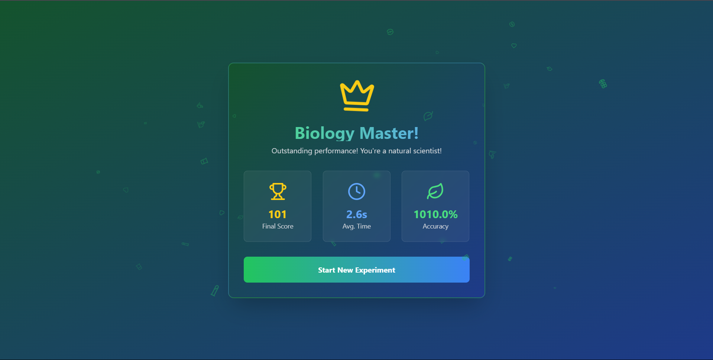

# BioQuest - Interactive Biology Quiz Application

## Table of Contents

1. [Introduction](#introduction)
2. [Features](#features)
3. [Tech Stack](#tech-stack)
4. [Installation](#installation)
5. [Usage](#usage)
6. [Screenshots](#screenshots)
7. [License](#license)

## Introduction

BioQuest is an engaging, interactive quiz application focused on biology education. It features a dynamic user interface with animated elements, real-time scoring, and educational content to make learning biology both fun and effective. The application combines timed questions, streak bonuses, and immediate feedback to create an immersive learning experience.

## Features

* 🎯 Dynamic question management with timed responses
* ⏱️ 30-second timer for each question
* 🎨 Animated UI elements with floating biology-themed icons
* 💯 Advanced scoring system with:
  * Base points for correct answers
  * Time bonus based on response speed
  * Streak bonus for consecutive correct answers
* 📚 Detailed reading materials for each question
* 📊 Performance tracking and progress visualization
* 🎮 Interactive question cards with immediate feedback
* 🔄 Quiz restart functionality
* 📱 Responsive design for various screen sizes

## Tech Stack

### Frontend

* **React** - UI library
* **TypeScript** - Type safety and better developer experience
* **Tailwind CSS** - Utility-first CSS framework
* **Framer Motion** - Animations and transitions
* **Lucide React** - Icon components
* **Axios** - HTTP client

### Backend

* **Node.js** - Runtime environment
* **Express** - Web framework

## Installation

1. Clone the repository:

```
git clone https://github.com/PratyayKoley/Quiz-Flow.git
```

2. Install dependencies:

   ### Frontend


   ```
   cd Frontend
   npm install
   ```

   ### Backend

   ```
   cd Backend
   npm install
   ```
3. Set up environment variables:

   Create a .env file in the Frontend and Backend folder

   ### Frontend


   ```
   VITE_BACKEND_LINK=your_backend_link
   ```

   ### Backend

   ```
   PORT=5000 // (default, you can change it)
   API=https://api.jsonserve.com/Uw5CrX
   ```
4. Configure the database connection in `.env`

## Usage

1. Start the backend server:

   ```
   cd Backend
   nodemon app.ts
   ```
2. Start the frontend development server:

   ```
   cd Frontend
   npm run dev
   ```
3. Access the application at `http://localhost:5173`

## Screenshots

### Home Screen


### Quiz Interface


### Results Screen



## License

This project is licensed under the MIT License - see the [LICENSE.md](LICENSE.md) file for details.

---

### Contributing

Contributions are welcome! Please feel free to submit a Pull Request. For major changes, please open an issue first to discuss what you would like to change.

### Contact

For any queries, please reach out to [pratyaykoley@gmail.com](mailto:pratyaykoley@gmail.com)
